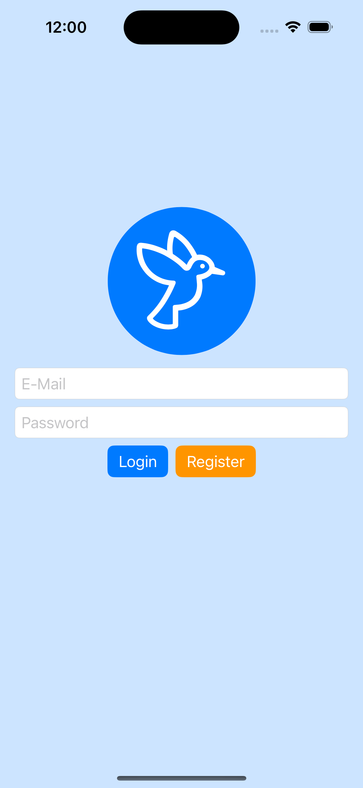
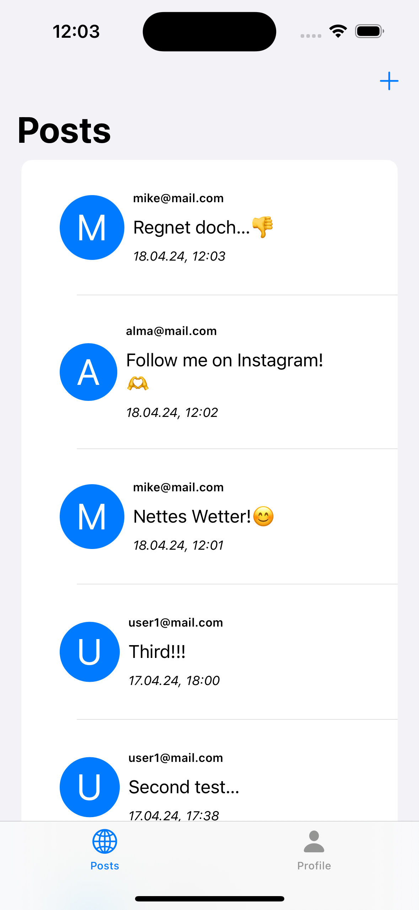
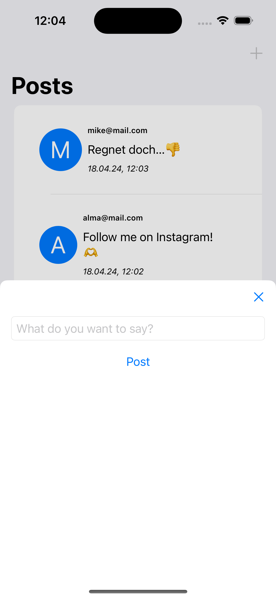
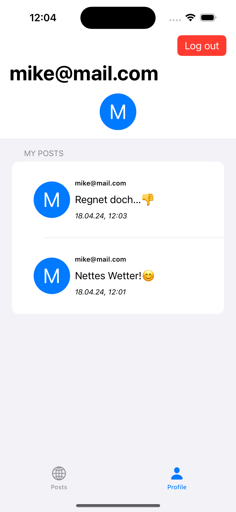

# iOS_PA_SocialNetwork

Du weißt jetzt (fast) alles, was es über Firebase zu wissen gibt, und baust heute zur Abwechslung was ganz neues: einen Twitter-Klon. Oder zumindest Twitter in seiner reinsten Form und mit den folgenden Features:

- Einloggen oder Account erstellen (E-Mail und Passwort)
- Einen öffentlichen Post verfassen
- alle Posts von allen anderen Usern sehen (in absteigenden zeitlichen Reihenfolde)
- nur die eigenen Posts auflisten
- ausloggen

*Das SFSymbol für den Vogel heißt "bird".*

## Projekt(e) erstellen
1. Erstelle in dem Ordner von diesem Repository ein neues Xcode-Projekt. Achte bei der erstellung darauf, das von Xcode kein zusätzlichen Repository erstellt wird. Achte außerdem darauf, dem Projekt eine einmalige BundleID zu vergeben.
2. Erstelle ein entsprechendes Projekt in Firebase. Erstelle dort die iOS-App-Verknüpfung und dort drin gleich die FirebaseAuth und FirebaseFirestore integration.
3. Verknüpfe dein Xcode-Projekt mit Firebase. Importiere die `.plist`-Datei und installiere das FirebaseSDK. Achte darauf, gleich die benötigten Bibliotheken für FirebaseAuth und FirebaseFirestore zu verknüpfen.

## Die Views und Viewmodels
Erstelle die benötigten Views:
1. View zum Einloggen oder Registrieren
2. Hauptview mit zwei Tabs
3. Erster Tab: Übersicht alles Beiträge. Jeder Beitrag zeigt, von wem dieser Verfasst wurde (E-Mail), den Beitrag selbst und den Zeitspempel. Optional auch eine Art "Profilbild" aus dem ersten Buchstaben der E-Mail der/des Verfasser/in.
4. Zweiter Tab: Profil. Hier werden nur die Beiträge der eingeloggten Person aufgelistet. Zusätzlich gibt es einen Button zum Ausloggen.

Die Views müssen nicht zwingend so ausehen, wie in den Screenshots.

## Die Daten
Überlege, wie du die Datenstruktur aufbauen kanns, um die Features umzusetzen. In jedem Fall brauchst du ein Model für ein/e User/in und ein Model für einen Beitrag.

  
Hier ist die Lösung

Am besten eignet sich hier der "flache" Aufbau, das heißt die Collections für die Benutzer/innen und die Beiträge liegen auf einer Ebene. Die Beiträge beinhalten zusätzlich die User-ID und die E-Mail. So können wir ganz einfach für den erstern Screen alle Beiträge holen. Für den Profil-Screen machen wir dann das Gleiche, nur dass wir zusätzlich nach der ID der eingeloggten Person filtern.

## Die Clients
So wie gestern und vorgestern kannst die den Code für die Authentifizierung und die Bearbeitung der Daten in spezielle Klassen auslagern. Beachte dabei, dass du sehr viel Code aus dem LiveCode und den Aufgaben dieser Woche übernehmen kannst.